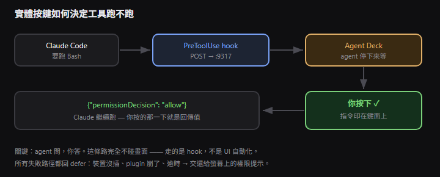
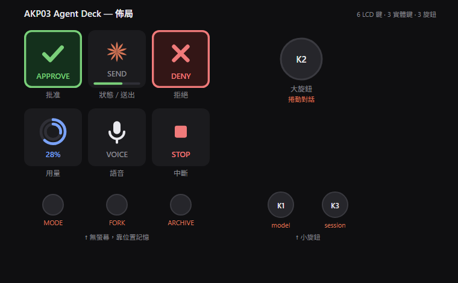
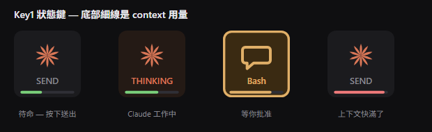
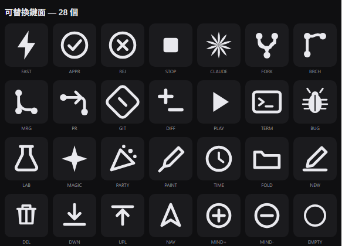

# AKP03 Agent Deck 操作說明書

## 這是什麼

把 Ajazz AKP03 變成 Claude Code 的**實體協作面板**。

不是「按鈕跑巨集」——巨集鍵盤做了二十年那個。這裡方向是**反過來的**：Claude 要跑 `Bash`​ 之前會停下來，**指令印在鍵面上**，`✓`​ `✗` 亮起，agent 等你按。你按的那一下，就是那個權限決定的回傳值。



靈感來自 OpenAI 的 Codex Micro，但那台售價 230 美元、只配 Codex。這台用你桌上已經有的硬體，接 Claude Code。

---

## 佈局



**上排回答 agent，下排對 agent 說話。**

|鍵|做什麼|
| ----| -------------------------------------------------------------------|
|**APPROVE**|批准 Claude 正在等的工具呼叫。**沒事時全黑**|
|**狀態 / 送出**|顯示 Claude 在幹嘛；按下＝送出輸入框內容。底部細線是 context 用量|
|**DENY**|拒絕。**沒事時全黑**|
|**用量**|雙環：外圈 context、內圈 plan。按一下開官方用量面板，再按關掉|
|**VOICE**|中文語音輸入（見下）|
|**STOP**|有東西在等＝拒絕並解除阻塞；沒有＝送 Escape 中斷|

### 為什麼 ✓ 和 ✗ 中間隔一整顆鍵

**誤觸**  **​`✓`​** ​ **的代價是放行一條你沒看清楚的破壞性指令，和誤觸**  **​`✗`​** ​ **完全不對等。**  Codex Micro 把兩顆排在一起，這裡不跟——實體鍵沒有 undo。

狀態鍵放中間也是刻意的：它是唯一永遠在講話的鍵。眼睛掃過去先看到「agent 在幹嘛」，答案就在左右手邊。

### 待命 vs 點亮

`✓`​ `✗`​ 平常是**全黑的**，只有真的有工具呼叫卡著等你才會亮。

這不是裝飾。一個永遠亮著的 `✓`​，你會忘記它什麼時候有意義；一個平常全黑、突然亮起來的鍵，你會**看**它。這台裝置的價值全押在「你有沒有真的看那一眼」。

---

## 狀態鍵



底部細線是 **context 用量**，綠 → 琥珀（75%）→ 紅（90%）。

放 context 而不是 plan，是因為那是**你按下送出那一刻最需要知道的事**——你下一則訊息吃掉的就是它。plan 用量看用量鍵。

**數字是讀出來的，不是估的**——直接讀 app 自己那顆按鈕的 `Usage: context 58%, plan 97%`。

---

## 三顆旋鈕

|旋鈕|轉|按|
| ------------| ---------------------| --------------------|
|**K1**（小・左）|開 model 選單並移動|選定 ｜ **連按兩下 = fast mode**|
|**K2**（大）|像滾輪一樣捲動對話|回到最新訊息|
|**K3**（小・右）|`Ctrl+Tab` 切 session|回到最新的 session|

### 為什麼 fast mode 是連按兩下而不是長按

**這個硬體做不到長按。**  實測按住 5 秒：

```
16:57:35.959  dialDown
16:57:35.986  dialUp      ← 27 毫秒後
```

AKP03 的驅動把每次按壓都回報成**一次瞬間點擊**，不管你按多久。「按住多久」這個資訊在驅動層就被丟棄，從來沒到達 OpenDeck。單次按壓則是可靠的離散事件——所以改成連按兩下。

代價：**K1 的單擊會延遲 400ms**，因為要等看你會不會按第二下。其他旋鈕沒有雙擊動作，零延遲。

---

## 三顆無螢幕鍵

|鍵|動作|
| ----| ----------------------------------------------------------------|
|**MODE**|循環權限模式：Manual → Accept edits → Plan → Auto → Bypass|
|**FORK**|分支這個 session|
|**ARCHIVE**|封存 session。**需要按兩下確認**|

它們**沒有螢幕**，只能靠位置記憶。這聽起來像缺點，但它篩選出了正確的用途：不能放任何要「看」的東西，正好適合你閉著眼睛按的動作。

**MODE 是延遲送出的**：按下只開選單並推進目標（鍵上顯示、描橘邊），**停手約 1 秒才真的切換**。連按三下就跳三個模式，而且你看得到自己走到哪。一次做完的話選單開了又關，快到來不及讀。

**ARCHIVE 要按兩下**，因為它在選單裡緊鄰 `Delete`，而這顆鍵沒有螢幕警告你。

---

## 中文語音

**Claude Code 的聽寫不支援中文。**  不是設定問題：

> `/voice`​ 顯示  **"zh-CN" is not a supported dictation language; using English.**

官方支援 20 種語言（英日韓法德…）沒有中文，[feature request #42920](https://github.com/anthropics/claude-code/issues/42920) 開著。

所以 VOICE 鍵走**全本機**管線，音訊不離開你的電腦：

```
按 VOICE → ffmpeg 錄音 → whisper.cpp 轉中文 → UIA 聚焦輸入框 → 貼上
```

用你已經有的 `~/whisper.cpp`​ 和 `ggml-large-v3-turbo.bin`。

三個狀態：`VOICE`​ → `REC`​（紅）→ `HEARING`（whisper 工作中）。

`autoSubmit`​ 預設**關閉**——逐字稿先留在輸入框給你看過。STT 對專有名詞常出錯，直接送出你會花更多時間收拾。看過之後按**狀態鍵**送出。

---

## 可替換鍵面



在 OpenDeck 的 property inspector 裡點一下就換，每顆綁一個 prompt。

**Keycap 打字進你正在看的 session 再送出**，不像 DISPATCH 開新的 headless run——因為 keycap 是「你本來會自己打的東西」的捷徑，你要看得到回答、也要保留上下文。

---

## 日常操作

**開機**：OpenDeck 會自己起來，plugin 跟著起來。裝置沒插的話一切照舊，不會有感覺。

**要讓 ✓ ✗ 真的亮起來**，需要 `PreToolUse`​ hook。合併 `claude/settings.hooks.json`​ 進 `.claude/settings.json`。

⚠️ **建議放專案層，不要全域**——deck 一次只服務一個 session。狀態機只有一個 pending 欄位，第二個 session 來就把第一個擠掉。全域裝又多開 session 會互相踩，而且畫面上看不出原因。

**Timeout 有方向性**：

```
config.json     approvalTimeoutMs: 90000   ← 必須比較小
settings.json   PreToolUse timeout: 120    ← 必須比較大
```

Plugin 一定要先放棄 → 回 `defer` → 你拿到正常的螢幕提示。Claude Code 先放棄 → 你拿到 hook 錯誤。

**所有失敗路徑都回** **​`defer`​**：裝置沒插、plugin 崩了、逾時、被新呼叫取代——全部交還給原本的權限流程。

> 一個沉默卡住 10 分鐘的 agent，比一個彈出螢幕提示的 agent 糟糕得多。

---

## 壞掉時

|症狀|看這裡|
| --------------------| ----------------------------------------------------------------|
|鍵全暗、沒反應|`plugin/com.hovell.agentdeck.sdPlugin/agent-deck.log`|
|旋鈕沒作用|同上——**每一格轉動都有紀錄**，所以「事件沒進來」和「進來了沒作用」分得出來|
|裝置沒被認出|`npm run detect` 比對 PID 是否在 opendeck-akp03 清單內|
|profile 莫名被清空|你可能刪了 `com.hovell.agentdeck` plugin。OpenDeck 找不到 action 就把鍵全設成 null|
|旋鈕行為打架|**官方 Stream Dock AJAZZ 在背景跑**，跟 OpenDeck 搶裝置|

**兩個 plugin 不重複**：`opendeck-akp03`​ 是**裝置驅動**（`"Actions": []`​，一顆按鍵功能都沒有），`com.hovell.agentdeck` 才是所有功能。

---

## 部署時踩到的坑

全都是實機打出來的：

|症狀|真正的原因|
| -------------------------| -----------------------------------------------------------------------------------------------------|
|plugin 啟動即死|**WSL 的** **​`wslrelay`​**​ **佔著 8787**。改用 9317|
|設定改了沒反應|**PowerShell 5.1 的**  **​`-Encoding utf8`​**​ **會加 BOM**，`JSON.parse` 爆掉後被吞掉、靜默用預設值|
|重啟 EADDRINUSE|OpenDeck 被殺時不回收子程序 → 孤兒抓著 port，**而**  **​`/status`​**​ **還會從殭屍回應假裝健康**|
|profile 寫了被清空|`ActionContext`​ 序列化成  **​`"Keypad.0.0"`​** （三段），不是文件寫的五段|
|鍵面空白|`setImage`​ 的 SVG **必須 base64**。percent-encoded 的不是合法 XML|
|旋鈕捲動只跳一下| **​`[Math]::Min(100, 99.85)`​** ​ **回傳** **​`100`​**​ —— 整數字面值讓 PowerShell 挑了 `Min(int,int)`​ 多載，**先把小數四捨五入**。每個小於 1% 的步進都被無聲抹掉|
|捲動延遲|每格開一個新程序 = **690ms**（PowerShell 啟動 215ms + UIA 載入 75ms + 掃 600 個元素 400ms）。改成常駐 host：**3ms**|
|文件說 `Ctrl+Shift+I` 開 model 選單|**實際開了無痕對話，還把視窗帶離 Code 分頁**。所以選單一律走 UIA，不送快捷鍵|

---

## 一條貫穿的線

最貴的 bug 全部是同一類：**壞掉的東西看起來是好的**。

- BOM → 設定靜默失效，用預設值跑得好好的
- 孤兒程序 → `/status` 從殭屍回應，看起來很健康
- `session`​ 鍵放在無螢幕鈕上 → `Setting image for button 8` 一切正常，圖丟進黑洞
- `Toggle()` 對失效參照 → 回報成功，什麼也沒發生
- `Min(int, int)` → 每個位置都是漂亮的整數，看不出被取整了

而最根本的那個：**PowerShell 用 Big5 輸出、Node 當 UTF-8 讀**，.NET 的在地化錯誤訊息全變成 `嚙瘡 "0" 嚙豬數呼嚙編`。我盯著那行亂碼猜了好幾輪，修好編碼之後第一眼就看到真答案，而且跟猜的不一樣。

> **除錯工具本身壞掉的時候，你不是在除錯，是在算命。**

---

## 為什麼這台能成立

三個查證過的事實：

1. **Claude Code 的 hook 支援** **​`type: "http"`​**  —— 直接 POST 到 daemon
2. **​`PreToolUse`​**​ **hook 能回** **​`permissionDecision`​** —— 實體鍵能真的決定工具跑不跑
3. **command/http hook 預設 timeout 600 秒** —— 阻塞等人按鍵完全在預算內

而 UI 自動化只是配角，還撞過牆：**Claude Code 的選項對話框對無障礙樹完全不可見**——三次探測都找不到，而一位盲人無障礙架構師的分析證實了同一件事（「focus is not moved into the dialog」）。他的解法也是 **hooks**。

**UI 是不可靠的表面，hook 是可靠的介面。**  你的 `✓`​ `✗` 從第一次測試就成功，K2 想從外面操作卡片卻永遠做不到——同一個原理的兩面。

---

*零 npm 依賴 ｜ 11 項合約測試*
